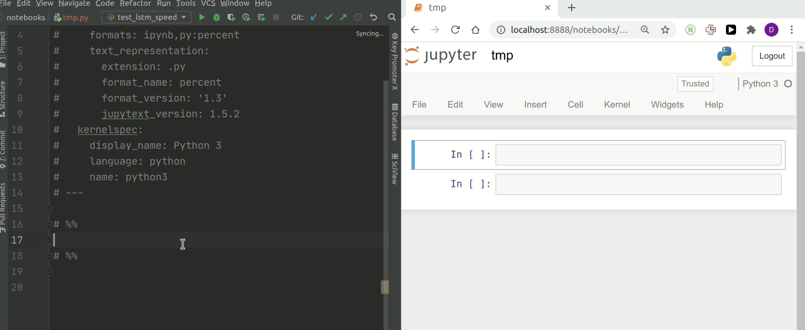
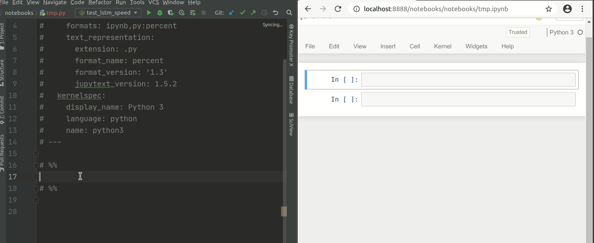

# Jupyter Browser Reload

Flow-saving tool that automatically reloads Jupyter Notebook in a browser
when its source .py file is changed and executes changed cells.

It uses
* [Jupytext](https://github.com/mwouts/jupytext) - to synchronize .ipynb and .py files
* [Watchdog](https://github.com/gorakhargosh/watchdog) - to watch for .py file changes
* [Selenium](https://github.com/SeleniumHQ/selenium) - to have a full control over a browser with opened Jupyter Notebook 

## Why Jure
Jupytext is a great tool that for instance allows user to benefit from static code analysis of Jupyter Notebooks. However I always struggled with this workflow: after each edit of .py file I needed to manually reload browser and execute changed cells.



Jure automatically reloads browser on each .py file change, so it would instantly show actual notebook content. Additionally it scrolls to last changed cell and executes it. 
 



## Installation
The most non-trivial part is install ChromeDriver on you computer, here's [sample link for Ubuntu](https://tecadmin.net/setup-selenium-chromedriver-on-ubuntu/) for reference.
After that it's simply
```
pip install jure
```

## Usage
First, you need to sync your .ipynb file with .py with Jupytext, see [official manual](https://github.com/mwouts/jupytext#using-jupytext).

Then launch a Jupyter Notebook server (`jupyter notebook ...`).

Then run
```bash
jure --token=[TOKEN] --jupyter_root_dir=[ROOT_DIR] --notebook_path=[NOTEBOOK_PATH]
```
Where `[TOKEN]` as an access token which is required to access Jupyter Notebook from browser, `[ROOT_DIR]` is a path to directory from which `jupyter notebook ...` command was executed and `[NOTEBOOK_PATH]` is a path to the notebook .ipynb file you'll work with.

## Limitations
This is an experimental and unstable product, any issues, suggestions, feature requests and PRs are appreciated. Current problems:

* Only Google Chrome web browser is supported
* Selenium might be inconvenient
* No password auth / remote notebook hosts
* Only last changed cell is executed, also first cell with imports is always executed
* In some rare cases user needs to reload browser tab manually
* For large notebooks page reload might be too slow (tough one)